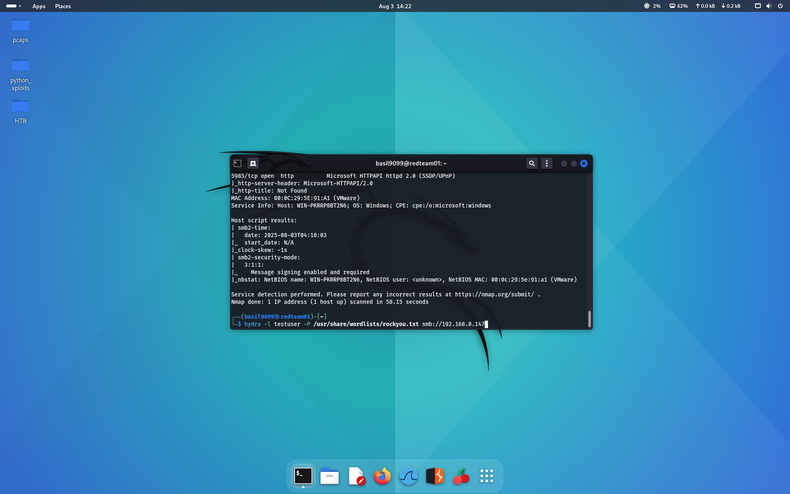
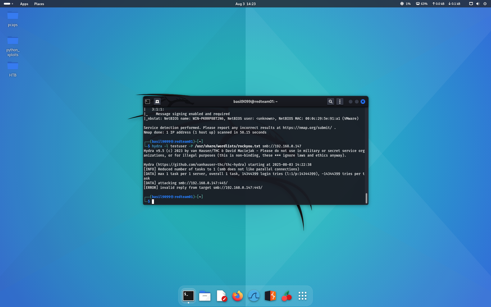
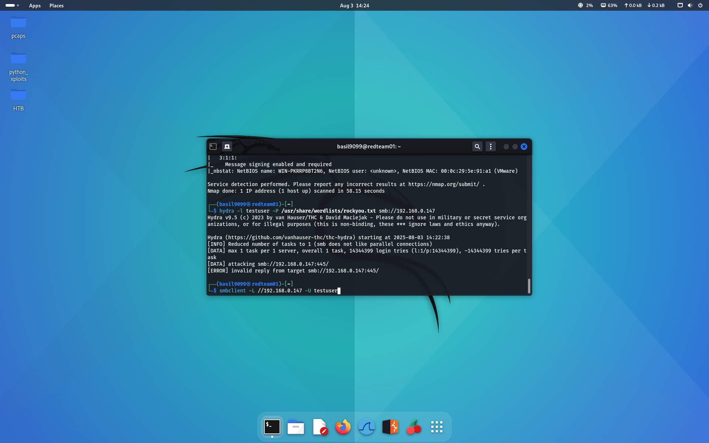
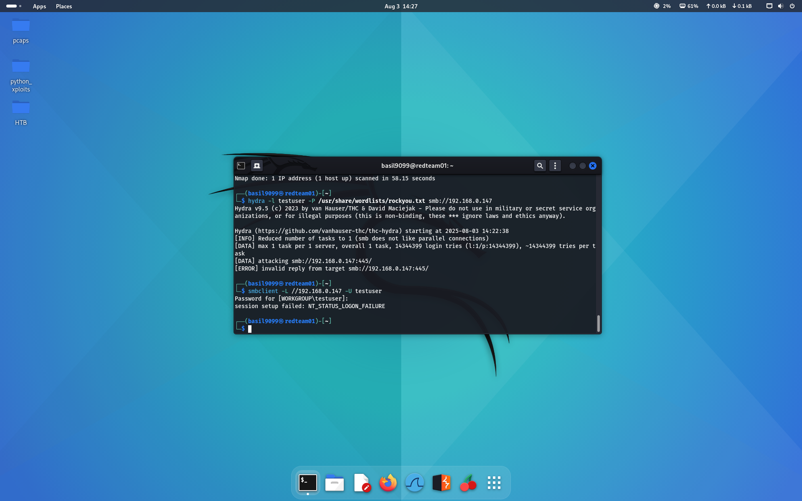
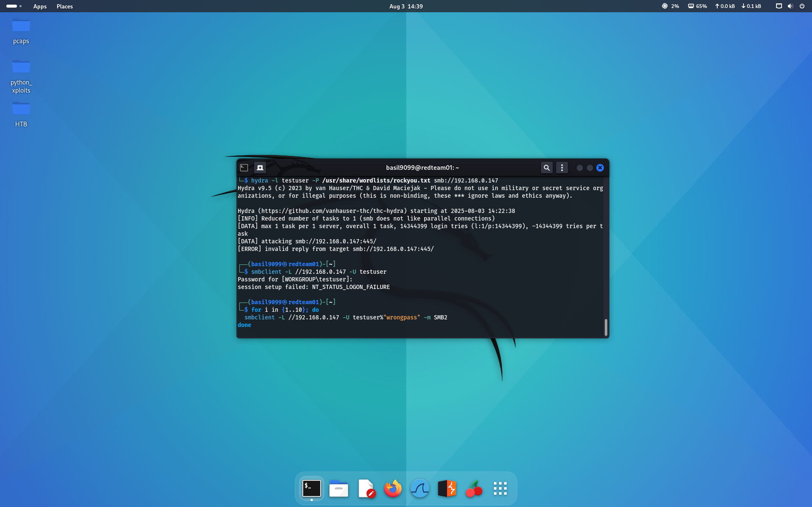
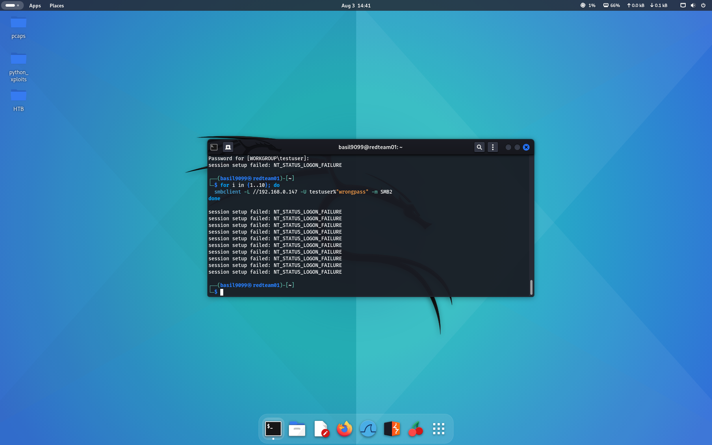
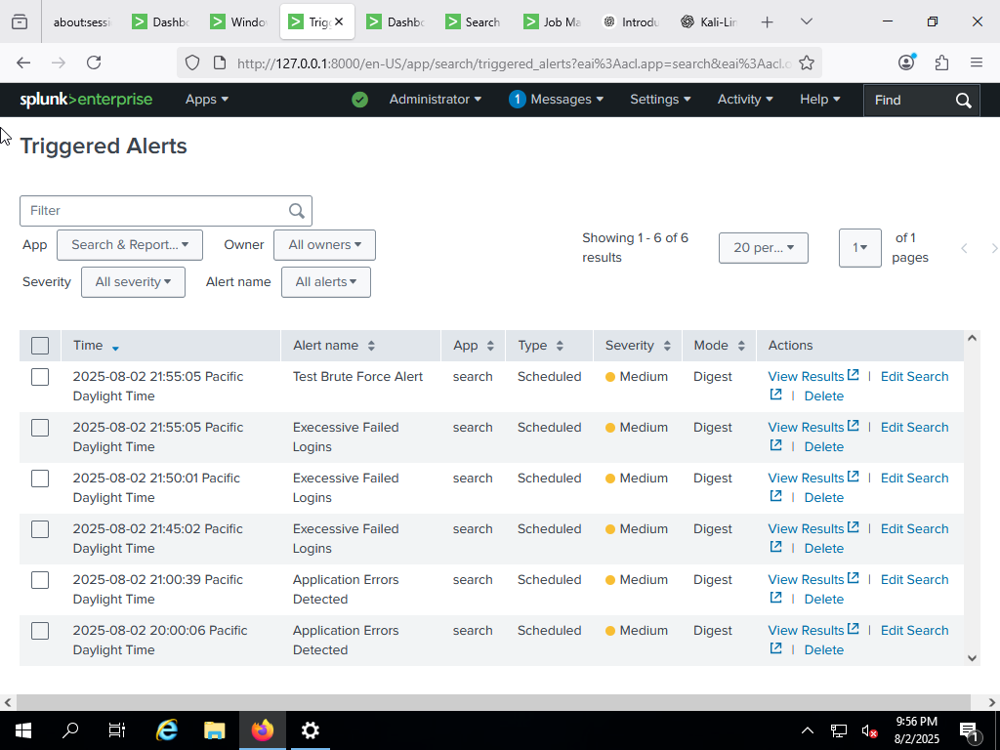

# 🔐 Brute-Force Detection Simulation (Kali ➡️ Windows ➡️ Splunk)

This test was conducted to validate Splunk's ability to detect brute-force login activity across the lab network.

---

## ✅ Goal

Simulate failed login attempts from Kali Linux to a Windows 10 host and verify:

- Event logging on the Windows system
- Log forwarding via Universal Forwarder
- Detection and alerting in Splunk

---

## 🧪 Steps

### 1. Nmap Scan

Initial enumeration of the target host to identify SMB and RDP services.



---

### 2. Hydra SMB Brute-Force

```bash
hydra -l testuser -P /usr/share/wordlists/rockyou.txt smb://192.168.0.147
```

Expected to produce `NT_STATUS_LOGON_FAILURE`.



---

### 3. Manual SMBClient Attempt

```bash
smbclient -L //192.168.0.147 -u testuser
```



---

### 4. Failed Login Confirmation

```bash
smbclient -L //192.168.0.147 -u testuser
# returns NT_STATUS_LOGON_FAILURE
```



---

### 5. Scripted Brute-Force Loop

```bash
for i in {1..10}; do
  smbclient -L //192.168.0.147 -u testuser%"wrongpass" -m SMB2
done
```




---

## 📡 Splunk Detection

Splunk alert triggered based on EventCode 4625 (Failed Logon):

```spl
index=wineventlog EventCode=4625
| stats count by Account_Name, src_ip
| where count > 5
```



---

## ✅ Success Criteria Met

✔️ Attack from Kali  
✔️ Logged by Windows (EventCode 4625)  
✔️ Forwarded by Universal Forwarder  
✔️ Indexed and searched by Splunk  
✔️ Alert triggered and visible in dashboard  

---

> 💡 This method can be adapted for other brute-force vectors: RDP, SSH, FTP, HTTP Auth.