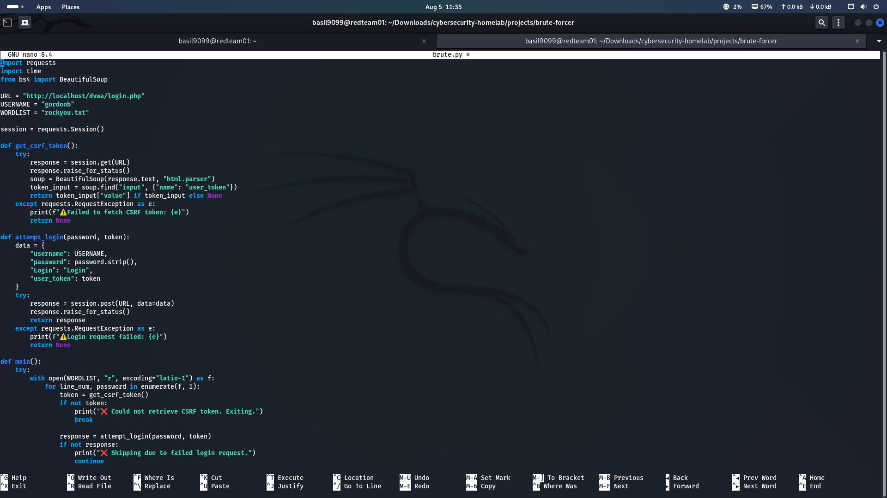
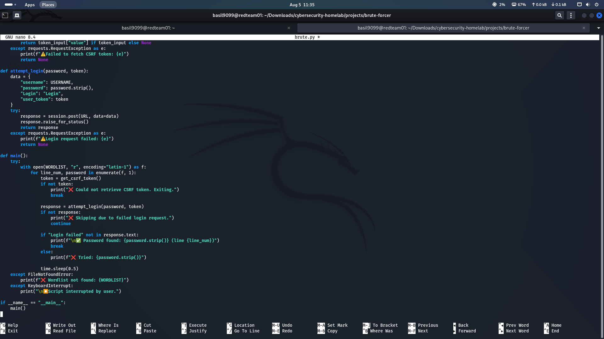
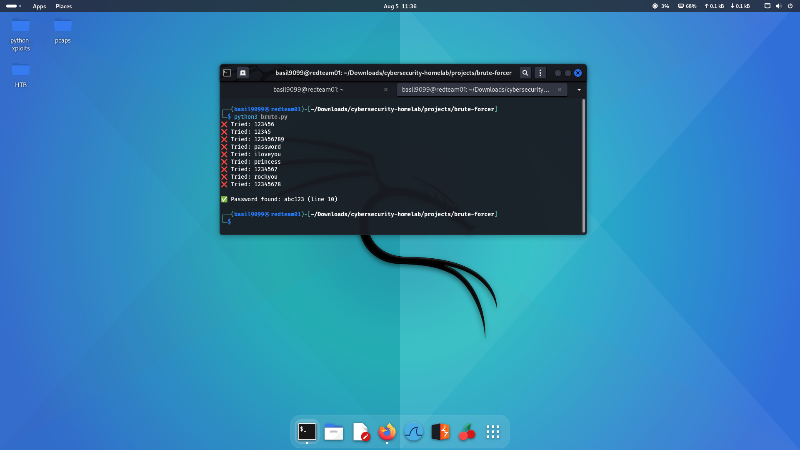
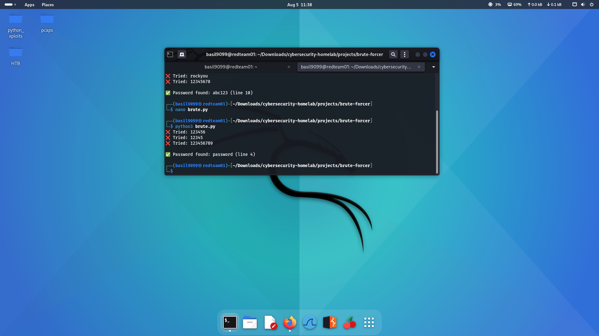
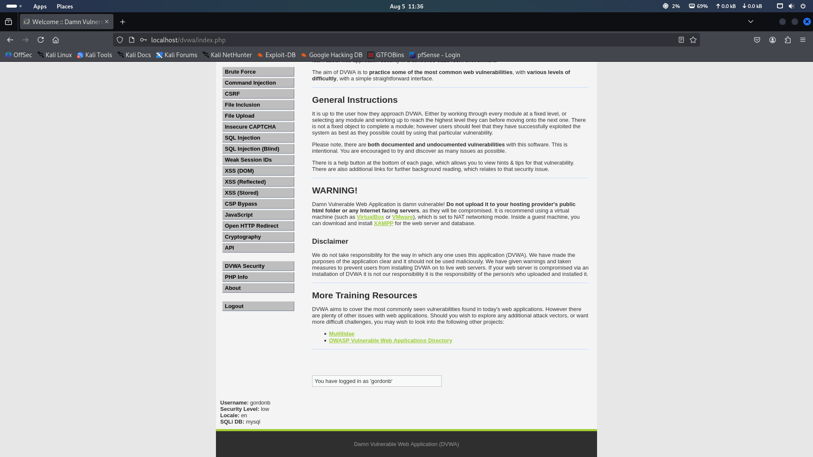
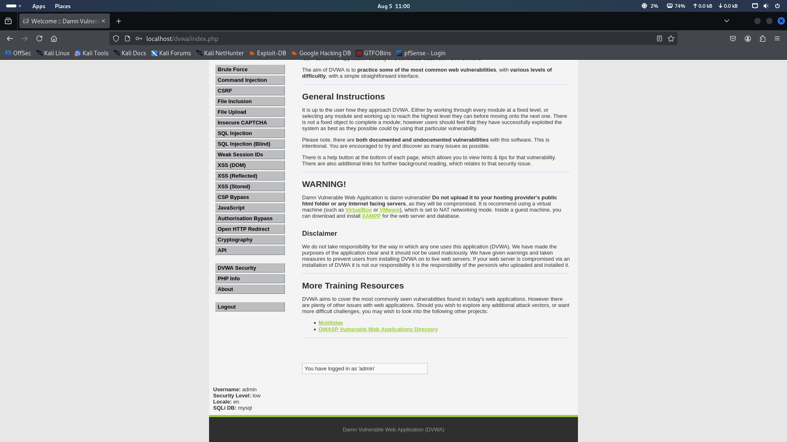

# 🔐 DVWA Brute-Force Automation Script

This Python script performs a dictionary-based brute-force attack on the **Damn Vulnerable Web Application (DVWA)** login form. It targets the login page hosted locally (`http://localhost/dvwa/login.php`), demonstrating a low-security brute-force exploitation.

> ✅ Tested and working successfully against DVWA on **Kali Linux**.

---

## ⚙️ Features

- Dynamically pulls CSRF token from each login attempt
- Uses `requests.Session()` to handle cookies automatically
- Clean output with successful and failed attempts
- Pauses gracefully on errors or keyboard interrupts

---

## 📸 Screenshots

> These demonstrate the attack sequence and successful credential discovery.

### 🔐 Brute Force Script (Part 1)



### 🔐 Brute Force Script (Part 2)



---

### ✅ Script Output: Successful Password Crack

  


---

### 🎯 Successful Login (in DVWA)

  


---

## 🧪 How to Test

1. **Ensure DVWA is running** on `http://localhost/dvwa/login.php`
    - Security Level: **Low**
    - Username: `gordonb`
    - Password: Include something like `abc123` or `password` in the wordlist for successful testing

2. **Set up environment**:
    ```bash
    sudo service apache2 start
    sudo service mysql start
    ```

3. **Run the script**:
    ```bash
    python3 brute.py
    ```

4. **Observe results**:
    - ❌ Failed attempts are clearly logged
    - ✅ Successful password crack is printed with line number

---

## 📂 File Structure

brute-forcer/
├── brute.py # Main brute-force script
├── rockyou.txt # Wordlist used for password attempts
├── README.md # This file

---

## 🧠 Learning Objective

This script was created to help understand:

- CSRF token handling during automated login attempts
- Working with Python's `requests` and `BeautifulSoup`
- Brute-force logic and defensive mitigation strategies
- Practical exploitation using DVWA in a safe lab environment

---

> ⚠️ **DISCLAIMER**: This script is for **educational use only** in a controlled lab environment. Never perform unauthorized testing on live or third-party systems.
