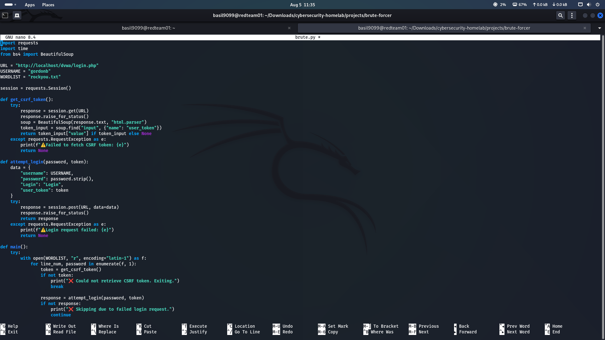
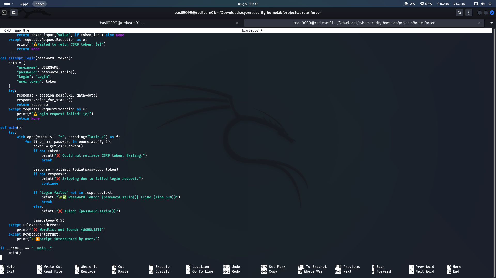
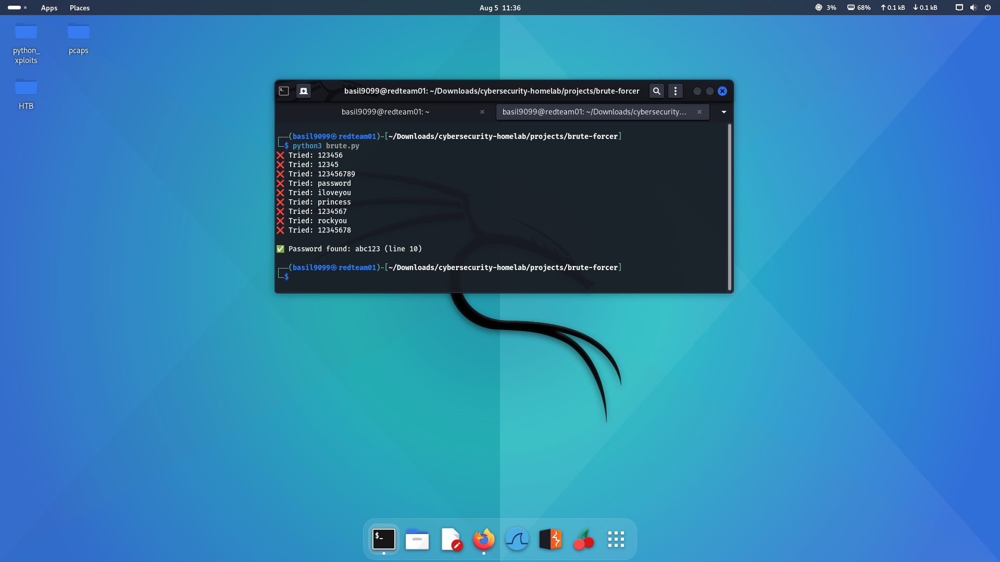
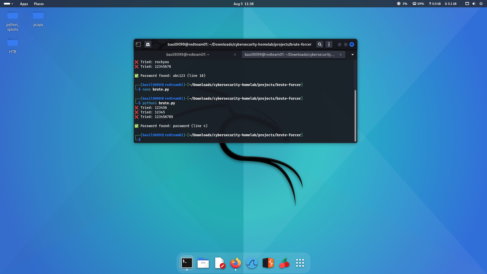
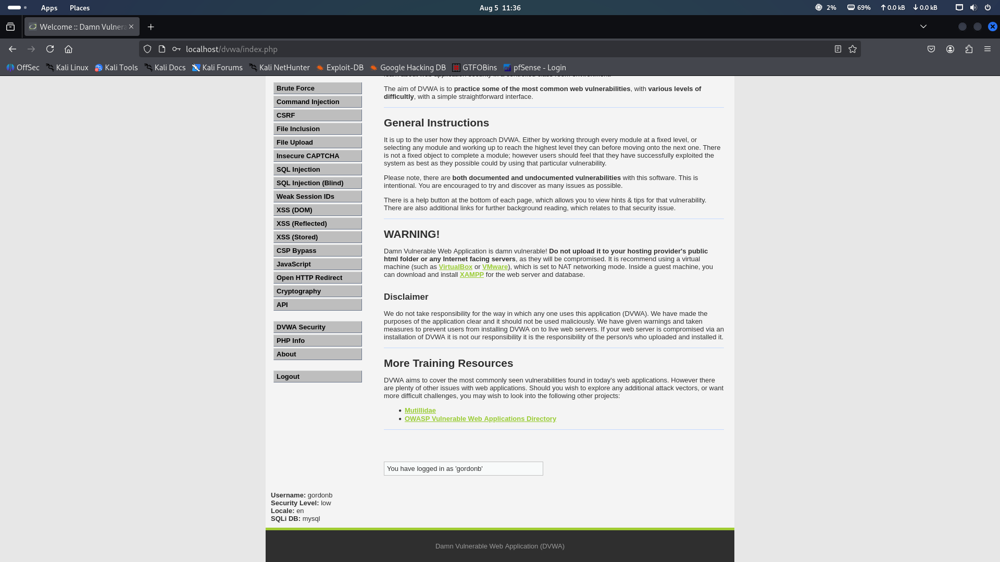
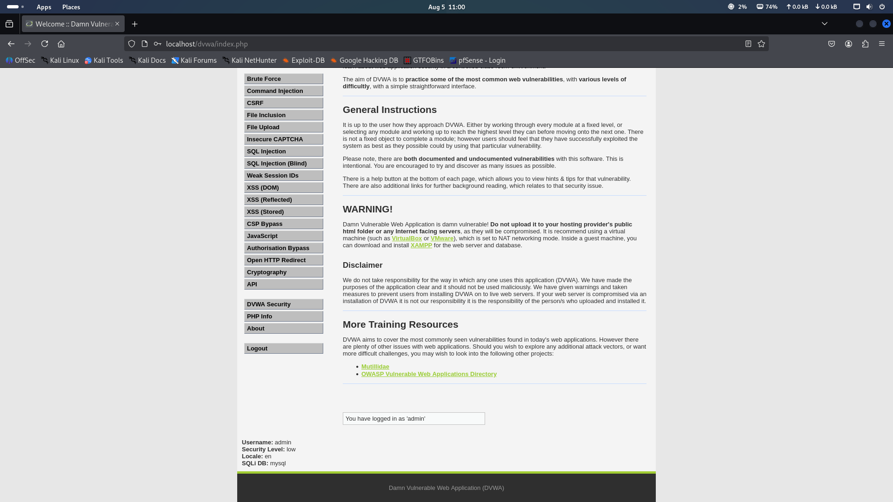

# Brute-Force Attack Scripts

Educational brute-force attack tools for use in a controlled homelab environment. Includes scripts targeting **DVWA** (Damn Vulnerable Web Application) and **OWASP Juice Shop**.

> **DISCLAIMER**: These scripts are for **educational use only** in a controlled lab environment. Never perform unauthorized testing on live or third-party systems.

---

## Scripts

### `dvwa_brute.py` — DVWA Login Brute Forcer

Performs a dictionary-based brute-force attack against the DVWA login form. Automatically handles CSRF token extraction using BeautifulSoup.

```bash
python3 dvwa_brute.py [options]
```

| Argument | Default | Description |
|---|---|---|
| `--url` | `http://localhost/dvwa/login.php` | Target login URL |
| `--username` | `admin` | Username to attack |
| `--wordlist` | `top1000.txt` | Path to wordlist file |
| `--delay` | `0.5` | Seconds between attempts |
| `--output`, `-o` | (none) | File to save successful results to |

**Example:**
```bash
python3 dvwa_brute.py --username gordonb --wordlist top1000.txt --delay 0.2
```

### `juiceshop_brute.py` — Juice Shop API Brute Forcer

Multithreaded brute-force attack against the OWASP Juice Shop REST login API.

```bash
python3 juiceshop_brute.py [options]
```

| Argument | Default | Description |
|---|---|---|
| `--url` | `http://localhost:3000/rest/user/login` | Target login URL |
| `--email` | `admin@juice-sh.op` | Email to attack |
| `--wordlist` | `top10000.txt` | Path to wordlist file |
| `--threads` | `10` | Number of concurrent threads |
| `--output`, `-o` | (none) | File to save successful results to |

**Example:**
```bash
python3 juiceshop_brute.py --threads 20 --wordlist top1000.txt -o results.txt
```

---

## Setup

1. **Install dependencies:**
    ```bash
    pip install -r requirements.txt
    ```

2. **For DVWA:** Ensure DVWA is running with security level set to **Low**:
    ```bash
    sudo service apache2 start
    sudo service mysql start
    ```

3. **For Juice Shop:** Ensure Juice Shop is running on port 3000.

---

## Screenshots

> These demonstrate the attack sequence and successful credential discovery.

### Brute Force Script (Part 1)



### Brute Force Script (Part 2)



### Script Output: Successful Password Crack




### Successful Login (in DVWA)




---

## File Structure

```
brute_forcer/
├── dvwa_brute.py         # DVWA brute-force script (sequential, CSRF-aware)
├── juiceshop_brute.py    # Juice Shop brute-force script (multithreaded)
├── requirements.txt      # Python dependencies
├── top1000.txt           # Top 1,000 common passwords
├── top10000.txt          # Top 10,000 common passwords
└── README.md             # This file
```

---

## Learning Objectives

These scripts help you understand:

- CSRF token handling during automated login attempts
- Working with Python's `requests` and `BeautifulSoup`
- Brute-force logic and defensive mitigation strategies
- Multithreading with `concurrent.futures`
- Command-line argument parsing with `argparse`
- Practical exploitation using DVWA and Juice Shop in a safe lab environment
